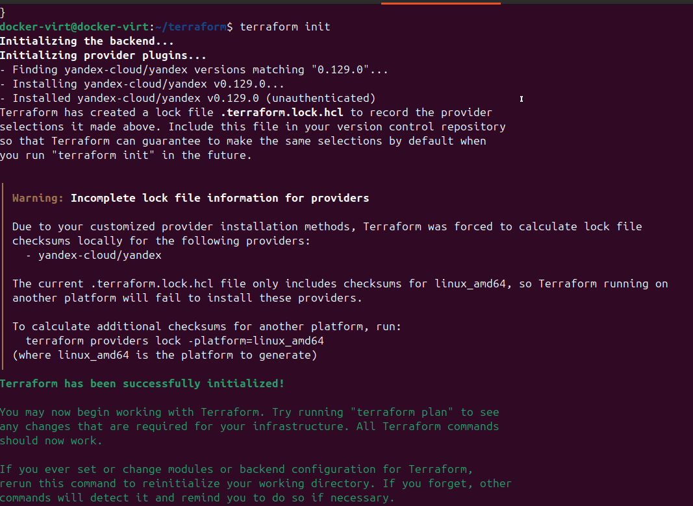
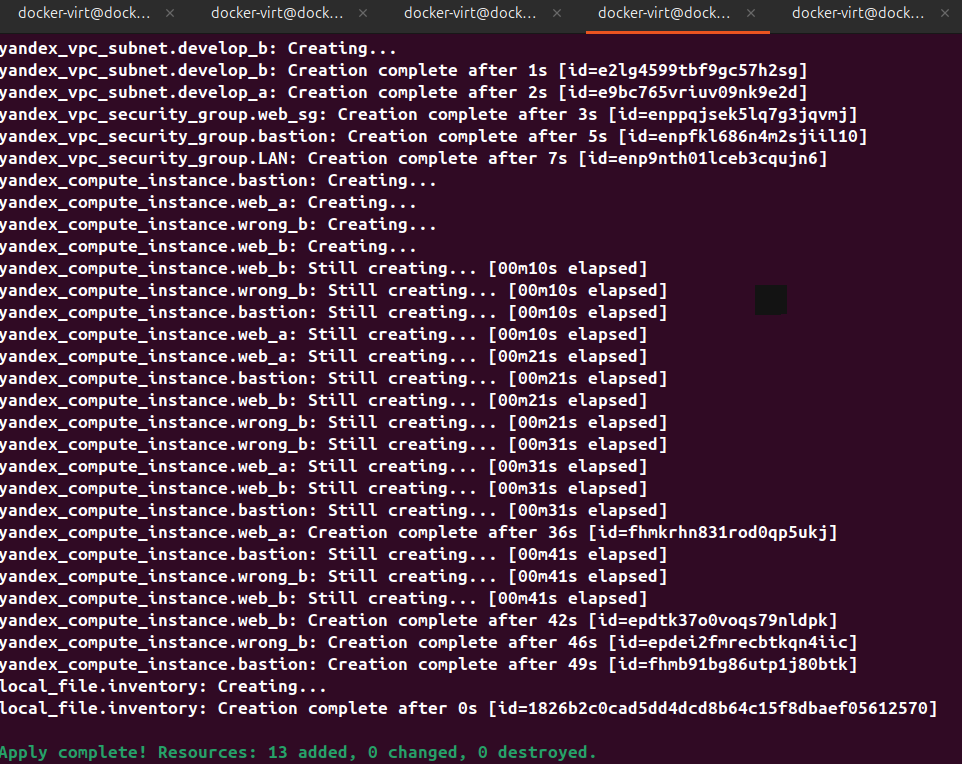
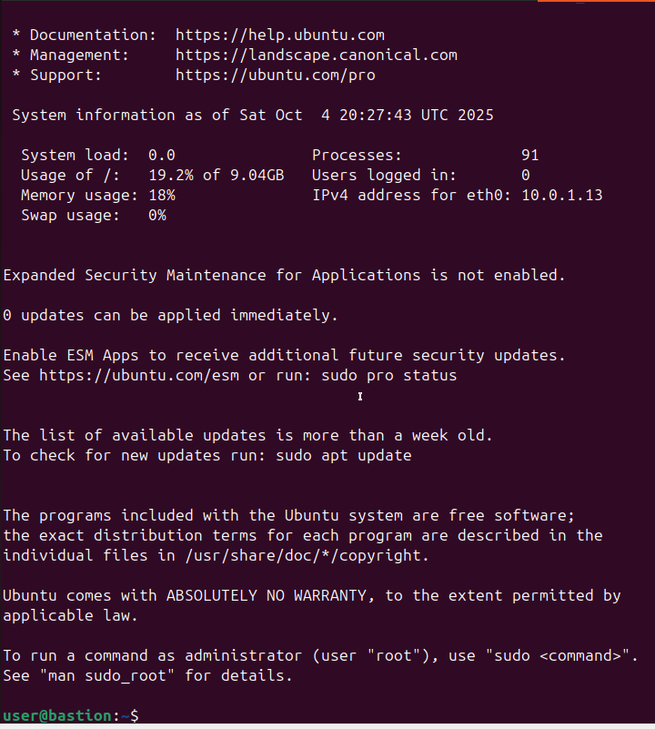
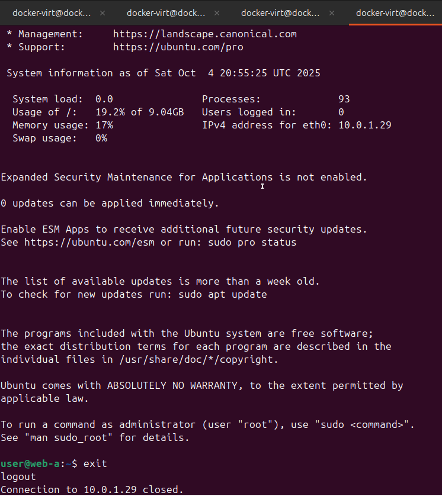
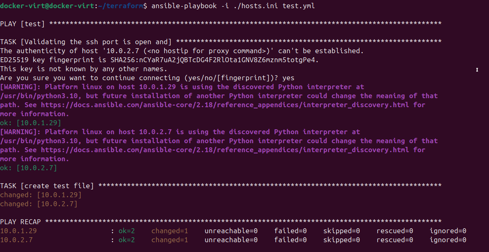
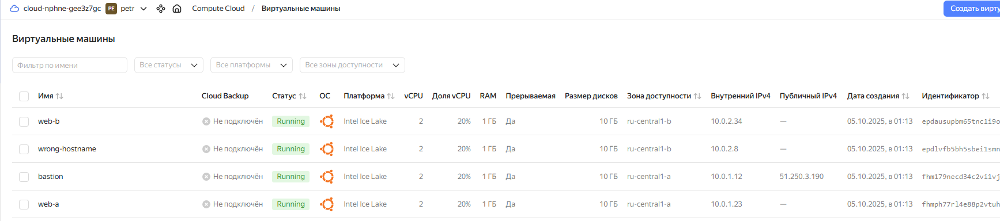

# Домашнее задание к занятию «Подъём инфраструктуры в Yandex Cloud» Петр Петров
### Задание 1
Задание 1
Повторить демонстрацию лекции(развернуть vpc, 2 веб сервера, бастион сервер)
### Решение 1
1. [Подключает провайдера Yandex Cloud и настраивает аутентификацию через ключ сервисного аккаунта](providers.tf)
2. [Определяет переменные, которые используются в других .tf файлах](variables.tf)
3. [Описывает создание VPC](network.tf)
4. [Создаёт виртуальные машины — 2 веб-сервера и один бастион](vms.tf)
5. [Скрипт для автоматической настройки ВМ при создании](cloud-init.yml)
6. [Хранит текущее состояние инфраструктуры (что создано, с какими параметрами). Без него Terraform не знает, что уже существует](terraform.tfstate)
7. [Резервная копия состояния на случай повреждения или сбоя](terraform.tfstate.backup)
8. [Ansible playbook — используется для проверки подключения и базовой настройки](test.yml)

