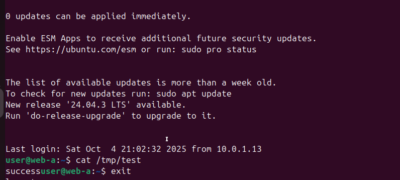
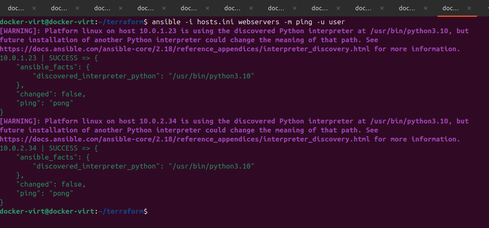
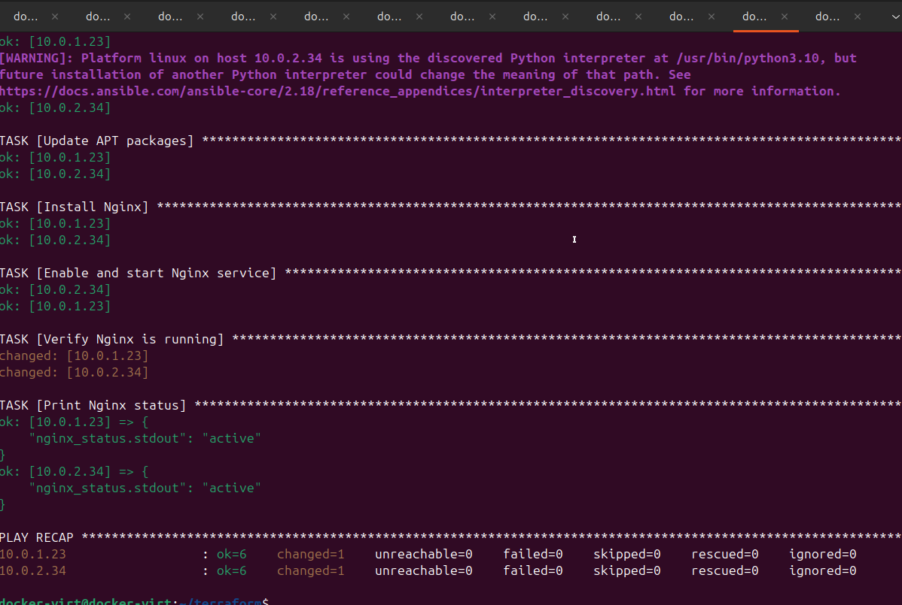
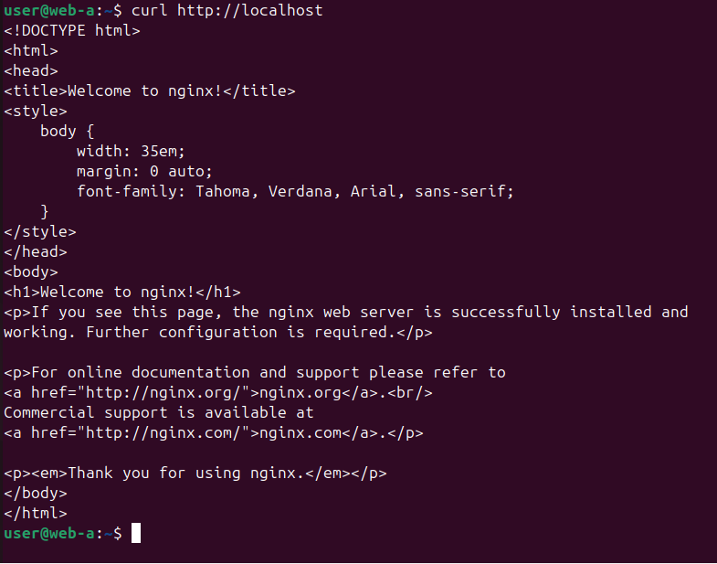
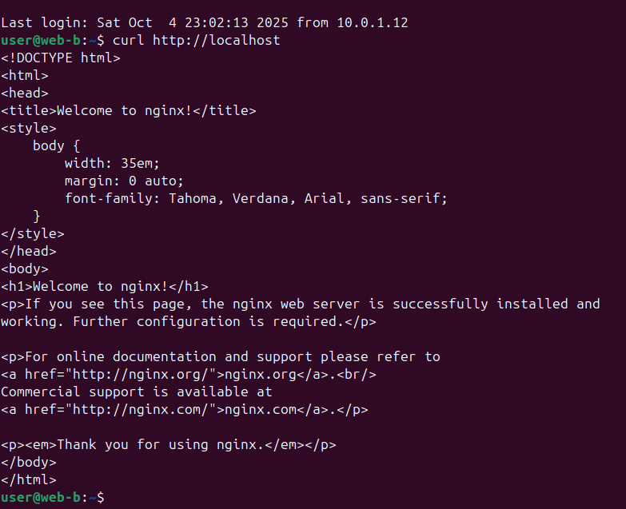
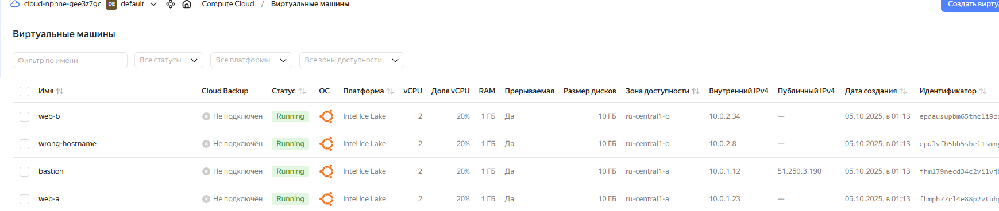

# Домашнее задание к занятию «Подъём инфраструктуры в Yandex Cloud» Петр Петров
### Задание 1
Повторить демонстрацию лекции(развернуть vpc, 2 веб сервера, бастион сервер)
### Решение 1
1. [Подключает провайдера Yandex Cloud и настраивает аутентификацию через ключ сервисного аккаунта](providers.tf)
2. [Определяет переменные, которые используются в других .tf файлах](variables.tf)
3. [Описывает создание VPC](network.tf)
4. [Создаёт виртуальные машины — 2 веб-сервера и один бастион](vms.tf)
5. [Скрипт для автоматической настройки ВМ при создании](cloud-init.yml)
6. [Хранит текущее состояние инфраструктуры (что создано, с какими параметрами). Без него Terraform не знает, что уже существует](terraform.tfstate)
7. [Резервная копия состояния на случай повреждения или сбоя](terraform.tfstate.backup)
8. [Ansible playbook — используется для проверки подключения и базовой настройки](test.yml)

Инициализации рабочего каталога Terraform

terraform apply

Подключение к к bastion-серверу: ssh user@84.201.174.192

Подключение к приватному серверу web-a: user@84.201.174.192 user@10.0.1.29

Ansible подключается к серверам:

Развернутые в облаке ВМ:

### Задание 2
С помощью ansible подключиться к web-a и web-b , установить на них nginx.(написать нужный ansible playbook)

Провести тестирование и приложить скриншоты развернутых в облаке ВМ, успешно отработавшего ansible playbook.

### Решение 2

1. [Плейбук для установки nginx](install_nginx.yml)

Успешное подключение ansible к web-a и web-b

Установка nginx: 
ANSIBLE_HOST_KEY_CHECKING=False ansible-playbook -i hosts.ini install_nginx.yml

Успешная установка:

Проверка работы nginx на web-a:

Проверка работы nginx на web-b:

Развернутые в облаке ВМ:

